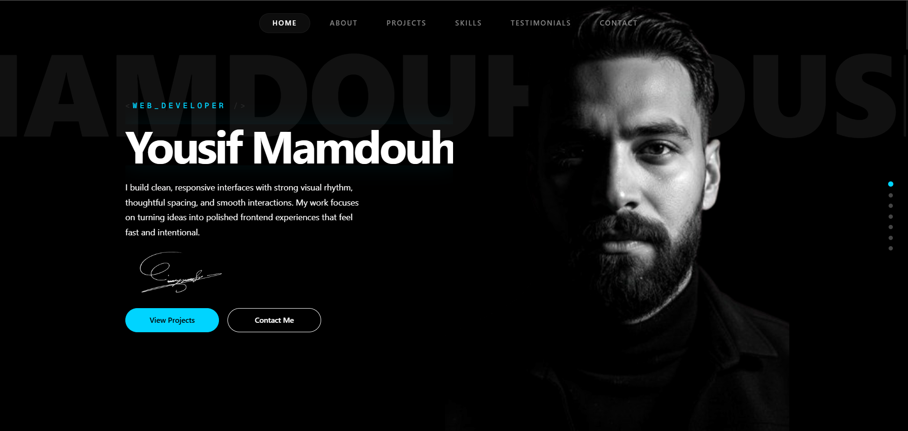

# 🚀 Project Title

# Yousif Mamdouh Portfolio

---

## 📸 Screenshots / Demo



[Desktop View](./public/assets/screenshot-disktop.png)

[Mobile View](./public/assets/screenshot-mobile.png)

[Live Demo](https://www.yousifmamdouh.tech/)

---

## 📖 Description

A modern, animation-rich personal portfolio built with Next.js App Router and TypeScript.

This project presents Yousif Mamdouh's profile, professional journey, selected projects, technical skills, testimonials, and contact channels in a highly visual single-page experience.

The UI is designed around:

- Smooth section transitions and reveal animations
- A distinctive floating portrait interaction between Hero and About sections
- Strong typography, dark aesthetic, and responsive layouts

---

## ✨ Features

- Intro loading screen with typed "Welcome" animation
- Fixed section-aware navbar with smooth-scroll navigation
- Dot side navigation (desktop)
- Hero section with animated watermark and CTA buttons
- GSAP ScrollTrigger-driven floating portrait transition from Hero to About
- About section with stats and timeline/journey content
- Projects section with responsive bento-style layout
- Interactive project cards with hover overlays and links
- Skills section powered by an interactive 3D icon cloud
- Testimonials section with featured and secondary cards
- Contact section with actionable cards (email, GitHub, LinkedIn, WhatsApp, Facebook, CV download)
- Responsive behavior tuned for mobile, tablet, and desktop breakpoints

---

## 🧰 Tech Stack

| Category | Technologies |
| --- | --- |
| Framework | Next.js 15 (App Router) |
| Language | TypeScript |
| UI / Styling | Tailwind CSS v4, CSS custom properties, utility classes |
| Animations | GSAP + ScrollTrigger, Framer Motion |
| Components / Utilities | Base UI, class-variance-authority, clsx, tailwind-merge |
| Icons / Visuals | react-icon-cloud, simple-icons, lucide-react |
| Theming | next-themes |
| Tooling | ESLint 9, PostCSS, shadcn/ui configuration |

---

## ⚙️ Installation

### 1) Clone the repository

```bash
git clone: https://github.com/YousifMHelal/portfolio-26.git
cd portfolio-26
```

### 2) Install dependencies

```bash
npm install
```

### 3) Start the development server

```bash
npm run dev
```

Open http://localhost:3000 in your browser.

---

## ▶️ Usage

### Development

```bash
npm run dev
```

### Production build

```bash
npm run build
npm run start
```

### Linting

```bash
npm run lint
```

Notes:

- This is currently a frontend portfolio application.
- Content is managed via in-repo data objects (see data/index.ts).

---

## 🗂️ Project Structure

```text
portfolio-26/
├── app/
│   ├── globals.css            # Global styles, theme tokens, responsive rules
│   ├── layout.tsx             # Root layout, metadata, fonts, ThemeProvider
│   └── page.tsx               # Main page composition + loading + GSAP scroll logic
├── components/
│   ├── layout/                # Navbar, footer, dot navigation, theme provider
│   ├── sections/              # Hero, About, Projects, Skills, Testimonials, Contact
│   └── ui/                    # Reusable UI pieces (ProjectCard, IconCloud, Button)
├── data/
│   └── index.ts               # Portfolio content (hero/about/projects/skills/etc.)
├── hooks/
│   └── index.ts               # Hook exports (currently placeholder)
├── lib/
│   └── utils.ts               # Utility helpers (className merge helper)
├── public/
│   └── assets/                # Images, project previews, CV PDF
├── types/
│   └── index.ts               # Shared TypeScript interfaces
├── eslint.config.mjs
├── next.config.ts
├── postcss.config.mjs
├── tailwind.config.ts
├── tsconfig.json
└── package.json
```

---

## 🔌 API Documentation (if applicable)

No backend API endpoints are defined in this repository.

- No app/api route handlers were found.
- Contact actions are external links (mailto/Gmail compose, social URLs, CV file download).

Assumption:

- If API features are planned later (e.g., contact form submission), they are not implemented yet in this codebase.

---

## 📜 Scripts / Commands

Defined npm scripts from package.json:

| Script | Command | Purpose |
| --- | --- | --- |
| dev | next dev --turbopack | Run local development server with Turbopack |
| build | next build | Create production build |
| start | next start | Run production server |
| lint | next lint | Run lint checks |

Additional useful commands:

```bash
# Install dependencies
npm install

# Run linting before commit
npm run lint

# Build to verify production readiness
npm run build
```

---

## 🔑 Environment Variables

No environment variables are currently required.

Verified from code scan:

- No process.env usage

Assumption:

- Future integrations (analytics, APIs, form services) may introduce environment variables.

---

## 📄 License

- All rights are reserved by the project owner.
